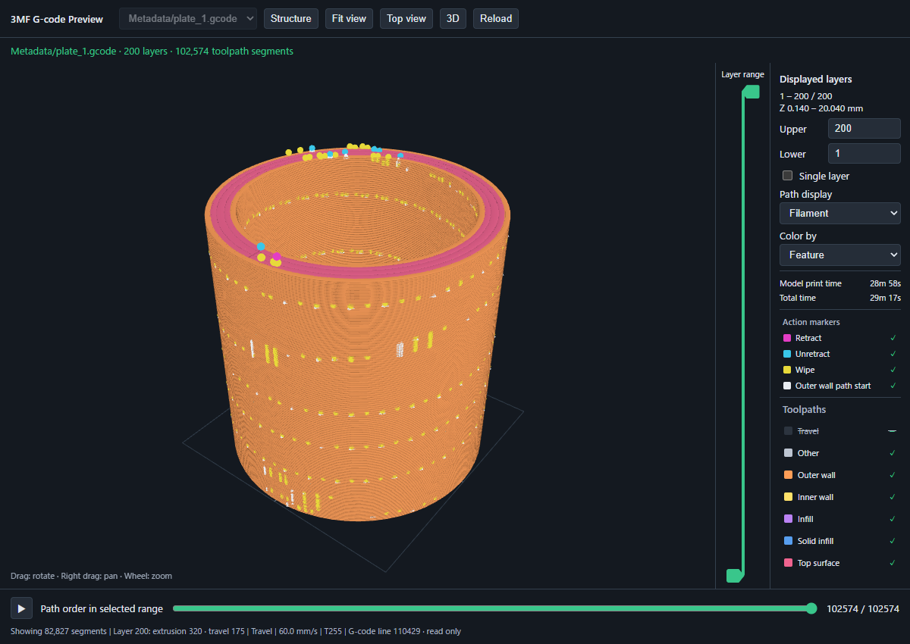
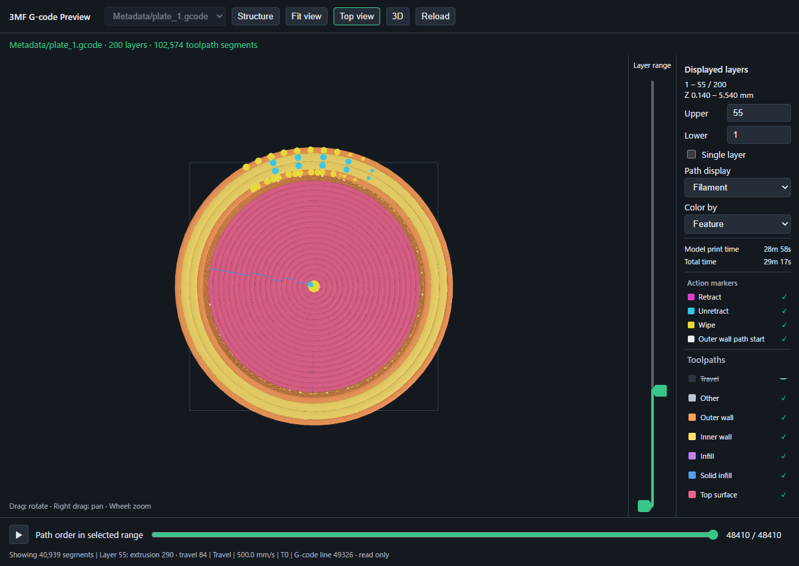
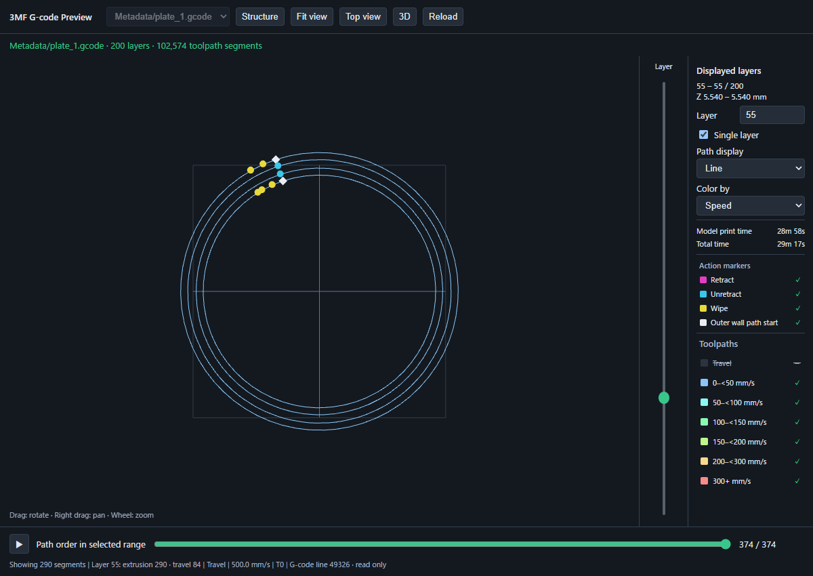
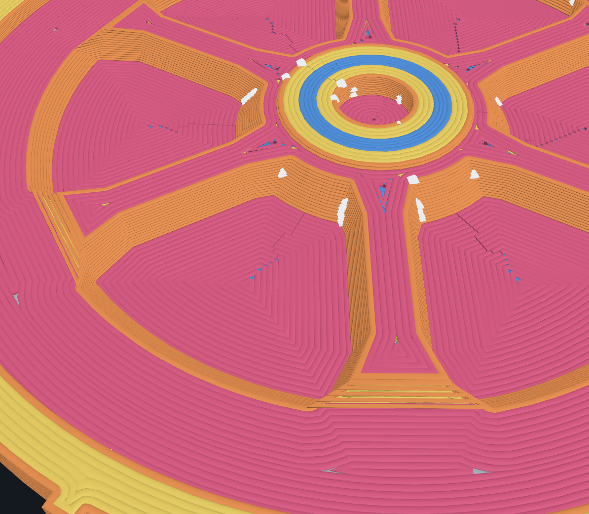
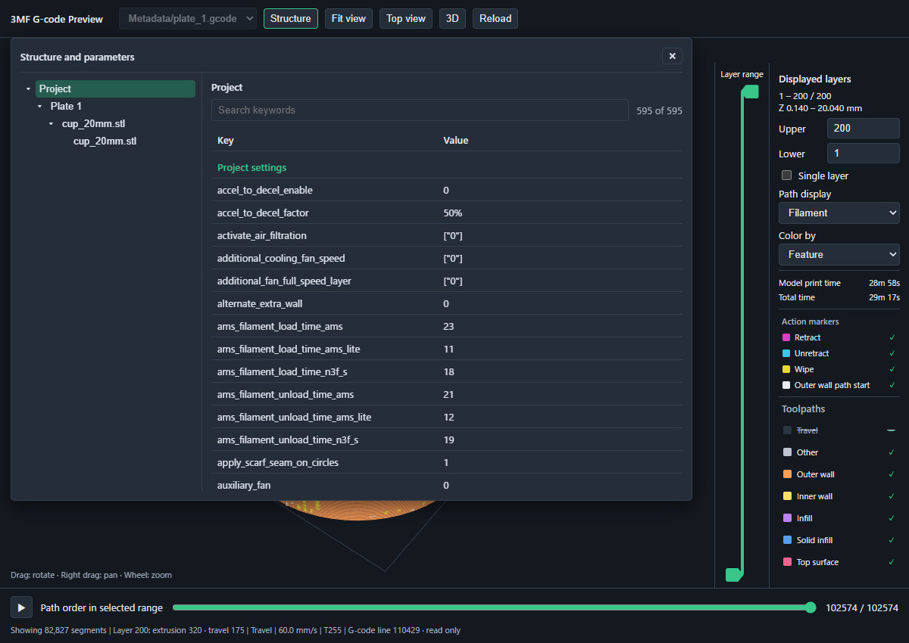
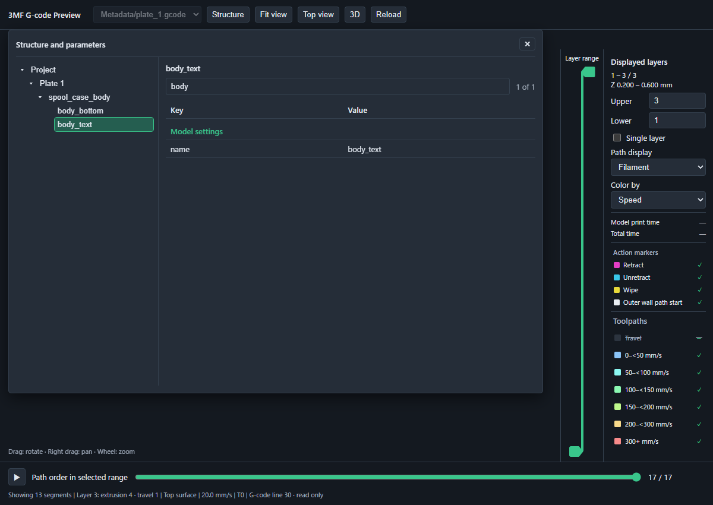

# 3MF G-code Preview

Explore a sliced 3MF print in VS Code: see the whole toolpath, isolate layers, and follow the order in which paths are printed. The viewer is read-only and never changes your 3MF file.

*A sliced 20 mm cup with 200 layers. The preview shows the complete print, path types, layer range, and slicer time estimates in one view.*

## Explore a print

### Focus on the layers you need

Drag the two handles or enter layer numbers to show a range. Switch to **Single layer** when you want to inspect one slice, and use **Top view** to see its path layout.

### See individual paths

Switch between filament-style paths and center lines. Color paths by type, speed, or tool; use the legend to hide categories and show travel moves separately. The path-order slider and play button reveal how the selected layers are printed.

Display choices are shared across files and restored when you reopen the preview. Layer selection and playback position stay with the current preview. The 3D grid uses 10 mm squares.

Another model shows how the two path displays handle a dense, detailed region:

*Filament view shows the approximate width of each deposited path.*

*The same area in Line view reveals the individual path routes.*

### Check what is in the file

Open **Structure** to browse the project, plates, objects, and parts without changing them. Select a tree item to see its settings and metadata in a key and value table, grouped by source. The search field filters the selected item's parameters by source, key, or value. Bambu-style project settings, model settings, and slice information are shown when present, along with metadata from the main 3MF model. The viewer also shows model and total print times when the slicer included estimates, plus optional markers for retraction, unretraction, wipes, and outer-wall path starts.

## Install and open

In VS Code, open the Extensions view, search for `3MF G-code Preview`, and install it from the Marketplace. Then open a `.gcode.3mf` or `.3mf` file. If another editor opens it, choose **Reopen Editor With…** and select **3MF G-code Preview**.

You can also run **3MF G-code Preview: Open 3MF** from the Command Palette.

For a toolpath preview, the 3MF must contain sliced G-code. In Bambu Studio, **Export plate sliced file** creates this kind of file. A 3MF project without G-code can show its model geometry, but this extension cannot slice it.

The interface follows the VS Code display language: Japanese for Japanese locales and English otherwise. Names stored in the 3MF stay as written in the file.

## What to expect

The viewer draws a preview from the file's model and G-code. Filament-style paths approximate deposited material; they are not a measurement of the finished print. Print times come from the slicer's estimates. Action markers are derived from G-code and may differ from printer behavior. The viewer does not determine seam positions or simulate firmware-specific commands.

Large or unsupported files may show an error. Warnings that affect the preview remain visible; routine notices about printer-specific commands are hidden. The extension does not send a job to a printer or start a print.

## Support

Report bugs or request features through the [GitHub issue tracker](https://github.com/mm-lab-dev/3mf-gcode-preview/issues). See [Support](SUPPORT.md) for what to include in a report.

This is an unofficial project and is not affiliated with or endorsed by Bambu Lab. Licensed under the [MIT License](LICENSE).
